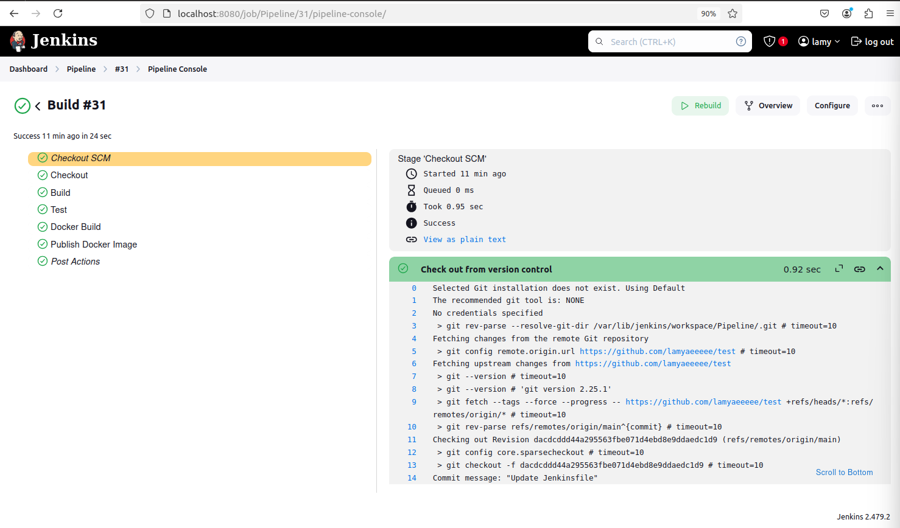
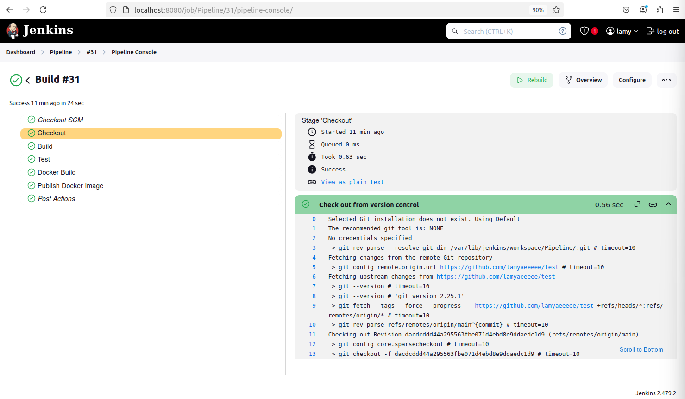
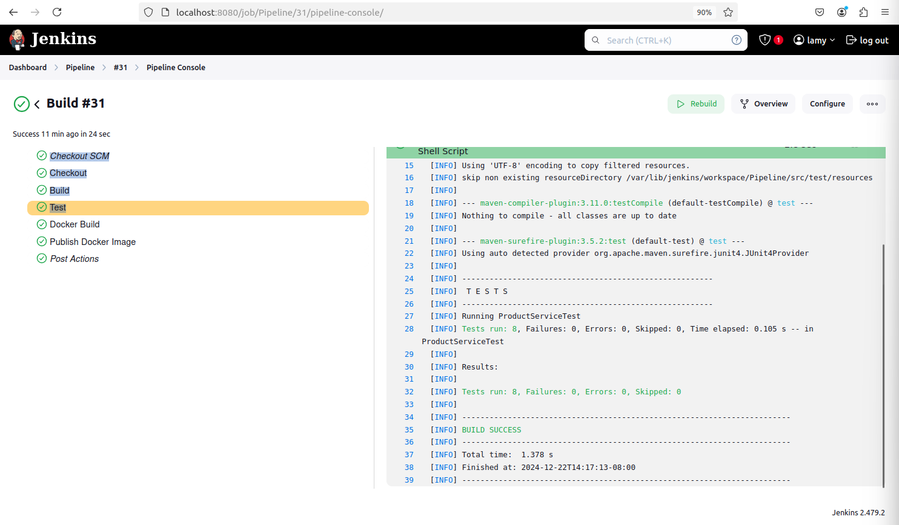
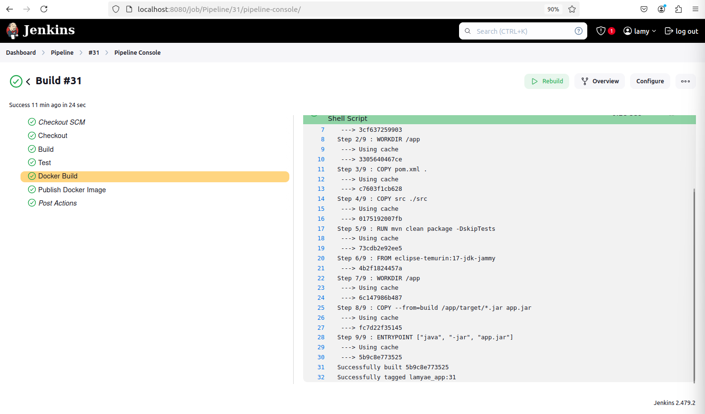
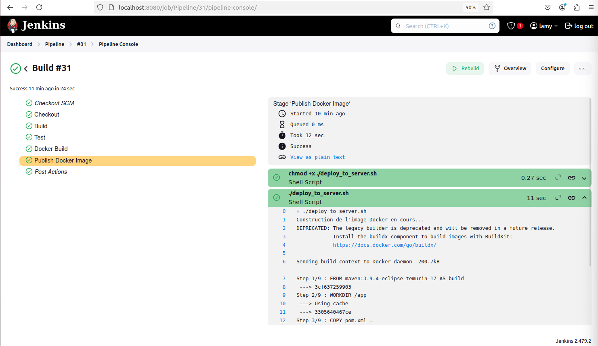
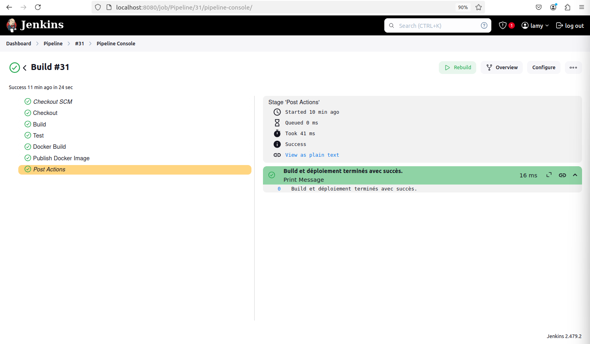

# Documentation du projet CI/CD avec Jenkins et Docker

## 🚀 Introduction

Ce projet implémente un pipeline **CI/CD** avec **Jenkins** et **Docker**. Le pipeline permet de :
- 🛠️ **Compiler** une application Java avec **Maven**.
- ✅ **Exécuter** des tests unitaires avec **Junit**.
- 🐳 **Construire** une image Docker.
- 🌐 **Pousser** l'image Docker vers **DockerHub**.
- 💻 **Déployer** l'image sur un serveur distant.

Les fichiers principaux utilisés pour ce pipeline sont le fichier **Jenkinsfile** et le script **deploy_to_server.sh**.

## 📄 Fichier **Jenkinsfile**

Le fichier **Jenkinsfile** définit l'ensemble du pipeline CI/CD dans Jenkins. Il spécifie les différentes étapes nécessaires pour construire, tester et déployer une application en utilisant **Maven** et **Docker**. Ce pipeline automatise le processus de déploiement en s'assurant que chaque étape se déroule correctement avant de passer à la suivante.

### **📝 Description générale du pipeline :**
Le pipeline Jenkins est organisé en plusieurs étapes (stages) qui assurent l'intégration et le déploiement continu (CI/CD) du projet. Voici un aperçu des étapes :

1. **Checkout** : Récupération du code source depuis le dépôt Git.
2. **Build** : Compilation du projet à l'aide de **Maven** pour générer les artefacts nécessaires.
3. **Test** : Exécution des tests unitaires avec **Maven** pour s'assurer que le code fonctionne comme prévu.
4. **Docker Build** : Création de l'image Docker du projet compilé pour faciliter le déploiement.
5. **Publish Docker Image** : Envoi de l'image Docker vers DockerHub et déploiement de l'application sur un serveur distant via un script.

Chaque étape est exécutée de manière séquentielle, garantissant ainsi la fiabilité du processus de déploiement.

### **🛠️ Étapes du pipeline :**

#### 1. **Checkout SCM et Checkout**
Cette étape récupère le code source à partir du dépôt Git, garantissant que le pipeline travaille avec la dernière version du code. Jenkins se connecte au dépôt Git, télécharge les dernières modifications et les prépare pour les étapes suivantes.

#### 2. **Build**
Dans cette étape, **Maven** est utilisé pour compiler le projet. Cela génère les fichiers nécessaires à l'exécution de l'application et à la création de l'image Docker.

#### 3. **Test**
Les tests unitaires sont exécutés à ce stade pour vérifier que l'application fonctionne comme attendu. Cela permet de détecter les éventuelles erreurs avant de déployer l'application.

#### 4. **Docker Build**
Cette étape crée une image Docker à partir du projet compilé. L'image contient tout le nécessaire pour exécuter l'application dans un environnement isolé.

#### 5. **Publish Docker Image**
Après la construction de l'image Docker, elle est poussée vers **DockerHub** pour faciliter le déploiement sur un serveur distant. Le script `deploy_to_server.sh` est exécuté pour déployer l'image.

#### 6. **Post Actions**
Une fois toutes les étapes terminées, des actions post-pipeline sont exécutées. Si le build et le déploiement sont réussis, un message de succès est affiché. En cas d'erreur, un message d'échec est généré.

## 📝 Script **deploy_to_server.sh**

Le script **deploy_to_server.sh** que j'ai développé permet d'automatiser le processus de déploiement de l'image Docker sur un serveur distant. Ce script exécute plusieurs actions clés pour garantir que l'application soit déployée correctement et fonctionne sans problème sur le serveur cible.

### 🛠️ **Fonctionnalités du script**

1. **Construction de l'image Docker**  
   Le script commence par la construction de l'image Docker en utilisant un **Dockerfile**. Cette étape est cruciale, car elle permet de générer l'image de l'application, incluant tous les composants nécessaires à son exécution dans un environnement conteneurisé.

2. **Connexion à DockerHub**  
   Après la construction de l'image, le script se connecte automatiquement à **DockerHub** en utilisant les identifiants fournis. Cela permet d'envoyer l'image Docker sur DockerHub, où elle sera stockée et prête à être récupérée pour un déploiement ultérieur sur d'autres machines.

3. **Poussée de l'image vers DockerHub**  
   Le script pousse ensuite l'image Docker vers DockerHub. Cela permet de rendre l'image disponible à tous les serveurs connectés à DockerHub et facilite ainsi le processus de déploiement.

4. **Déploiement sur un serveur distant**  
   Enfin, le script déploie l'image Docker sur un serveur distant via **SSH**. Le script se connecte à la machine cible (spécifiée par l'adresse IP `192.168.157.129`), récupère l'image Docker depuis DockerHub, arrête et supprime les conteneurs existants, puis lance un nouveau conteneur avec l'image mise à jour.

### **🖥️ Test sur deux machines Linux virtuelles**

- **Environnement de test**  
  Les tests ont été effectués dans un environnement composé de deux machines virtuelles Linux. La première machine compile et crée l'image Docker, tandis que la deuxième sert de serveur cible pour déployer l'image.

- **Adresse IP cible**  
  Dans le script, l'adresse IP `192.168.157.129` a été spécifiée pour cibler le serveur correct. Cela permet de garantir que l'image Docker soit déployée sur le bon serveur, avec une exécution totalement automatisée.

### **🏁 Conclusion**

Grâce à ce script **deploy_to_server.sh**, j'ai automatisé l'intégralité du processus de création, de publication et de déploiement de l'image Docker. Cela simplifie le flux de travail et assure un déploiement rapide et fiable, en garantissant que l'application sera déployée sur le serveur distant sans intervention manuelle.

## 🌟 Bilan du Projet

Grâce à ce pipeline **CI/CD** complet, automatisé avec **Jenkins** et **Docker**, j'ai pu mettre en place une solution qui compile, teste, crée l'image Docker, la pousse vers DockerHub, puis la déploie sur un serveur distant. Ce projet garantit une livraison rapide et fiable de l'application avec un processus de déploiement totalement automatisé et sans erreur.

## ✍️ Auteur

Ce projet a été réalisé par **Lamyae OULAD ALI**.  
Merci pour votre attention et votre temps ! 😊
